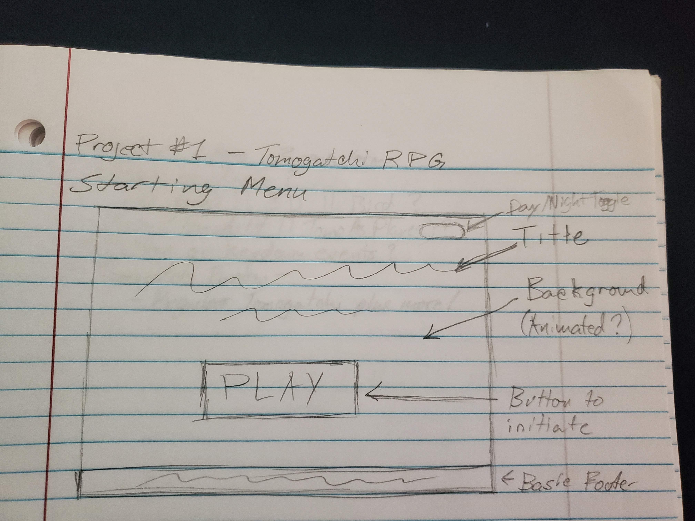
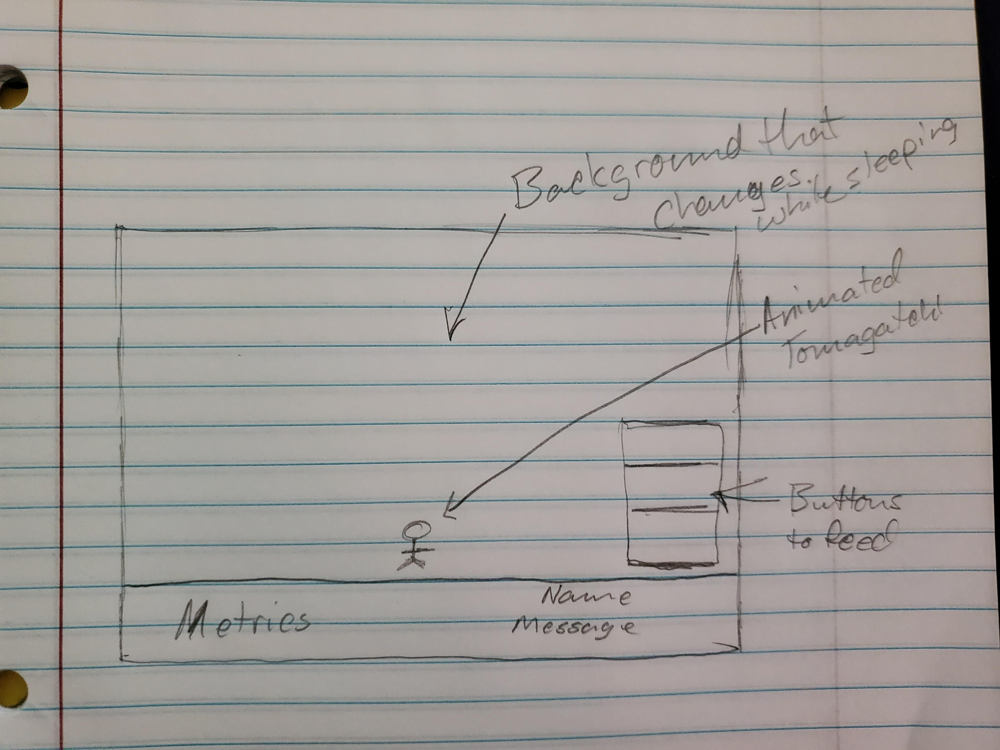

# Toma

## User Story

Toma is a game that's roughly based off of the popular handheld game called Tomagatchi. The game start off asking the user to name their new virtual pet. The object off the game is to keep your pet alive by interacting with it and caring for it. The user needs to keep an eye on the metrics displayed in the bottom left corner of the screen to make sure that none of them reach 10. To keep that from happening the user must click on the buttons on the right side of the screen to interact with the pet. If any of the metrics reach 10, then the pet will turn into stone and the game will end.

## Wireframes

## Technologies Used

HTML - Used for markup for everything that should always be displayed

CSS - Used for styleing and animations

javaScript - Used for adding timers and creating the tomagatchi

jquery - Used for event handling and adding html and css

## Approach

I started with making a static page in HTML by adding the title and the gameplay section. I used placeholder images so I could work on the functionality of the game. I used a class to create the tomagatchi and then did most of the manipulation using jquery. After, I started adding the styling and more functions. I took some time to work out any bugs and tweak the styles further. I plan to update the game at a later date since I still have some ideas of how I want the game to grow.